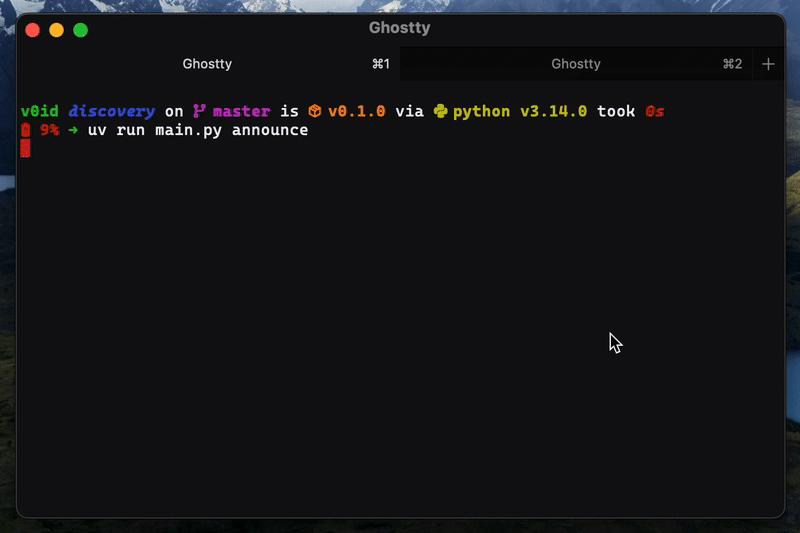

# ZeroConf Discovery

My experiment with ZeroConf Discovery.



# What is ZeroConf Discovery?

ZeroConf Discovery is a protocol that allows devices to discover each other on the network without the need for a central server. It is a part of the Bonjour/Zeroconf family of protocols.

# How does it work?

Devices register themselves with a Zeroconf server, and other devices can discover them by querying the Zeroconf server.

# How can I use/test it?

```bash
pip install -r requirements.txt
python main.py announce

python main.py discover
```


